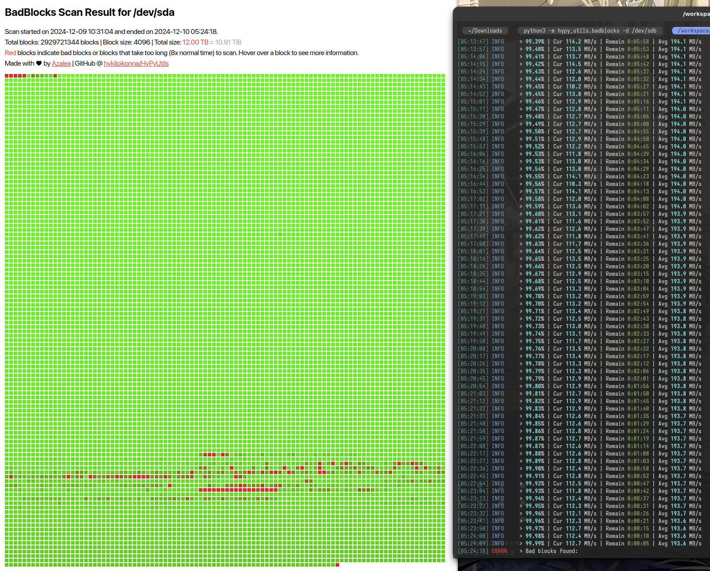

# HyPyUtils
 HyDEV Utils for Python

`pip install hypy_utils`

## Modules

Some modules have extra requirements that are not installed along with hypy_utils. These are listed below:

| Module             | Requirements             |
|--------------------|--------------------------|
| `tqdm_utils`       | tqdm                     |
| `downloader`       | tqdm, requests           |
| `scientific_utils` | numpy, numba, matplotlib |
| `git_utils`        | dateutil                 |

## BadBlocks - HDD sector scanning for Linux

Usage: `python3 -m hypy_utils.badblocks -d /dev/sda`

