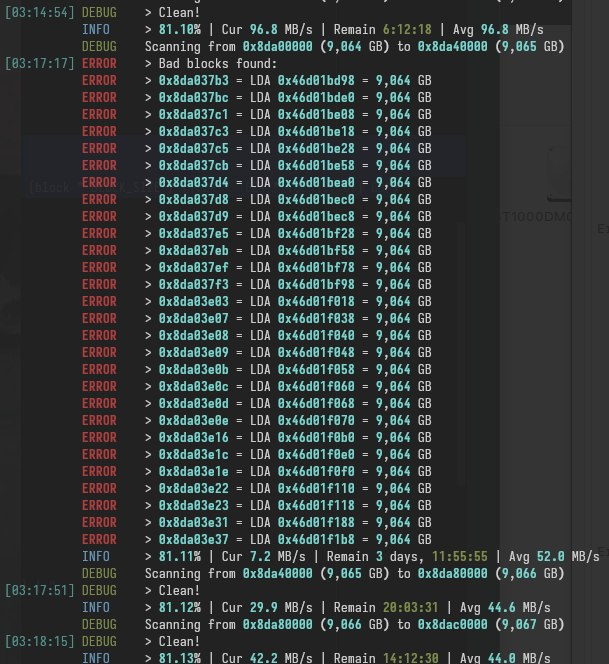

# HyPyUtils
 HyDEV Utils for Python

## Modules

| Module             | Requirements             |
|--------------------|--------------------------|
| `tqdm_utils`       | tqdm                     |
| `downloader`       | tqdm, requests           |
| `scientific_utils` | numpy, numba, matplotlib |
| `git_utils`        | dateutil                 |

## Utilities

### BadBlocks - A bad block scanning utility for Linux

Usage: `python3 -m hypy_utils.badblocks -d <device>`

